关于github多人协作的一些内容，并不是特别特别全，但是足够用了。

> 任务：
>
> 每个人在这个仓库加一个以自己id命名的文件夹，文件夹下有以自己id命名的txt，然后再主页面加个NAME.md（第一个人创建）,一级标题写自己id，下面写“完成”，commit为自己id

[toc]

# 简述

下面这张图非常重要！！！

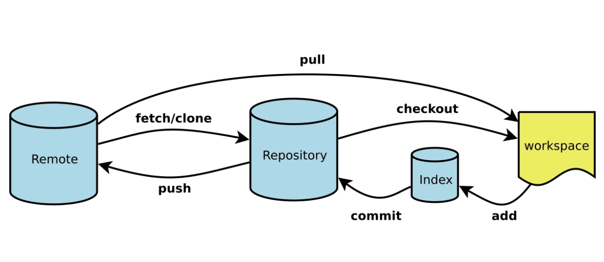

最常见的git add,commit和push我就不说了，上图很清楚。

第一次的时候，先clone到本地，再去做一些修改，然后push

之后的每次提交，一定要先pull，因为在这之前别人可能会提交，也就是说远程仓库和你自己的本地仓库内容不同，这样的话就需要你先将远程仓库的内容pull下来，然后再做修改。

这里会有这么一种可能，就是存在冲突的情况。这时就需要手动的处理冲突，修改后再做提交

# 示例

## 无步骤冲突时

这里我拿我的两个账号举例，一个在物理机一个在虚拟机，模拟两个人操作一个仓库。

首先要把人加进来，这个是由我来做：

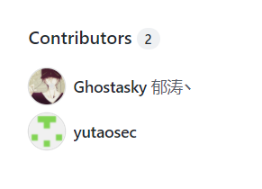

最原始的仓库什么都没有：

这里我们为了方便，一律使用main这个分支。

下面是yutaosec的账户：

首先要把该仓库clone到本地：

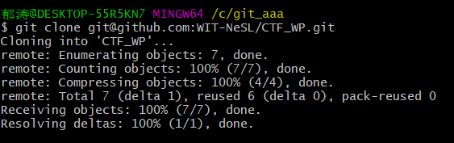

假设yutaosec做了一些操作，比如创建了yutaosec.txt并写了一些东西。

这时yutaosec用户和远程的仓库都有了改改动：

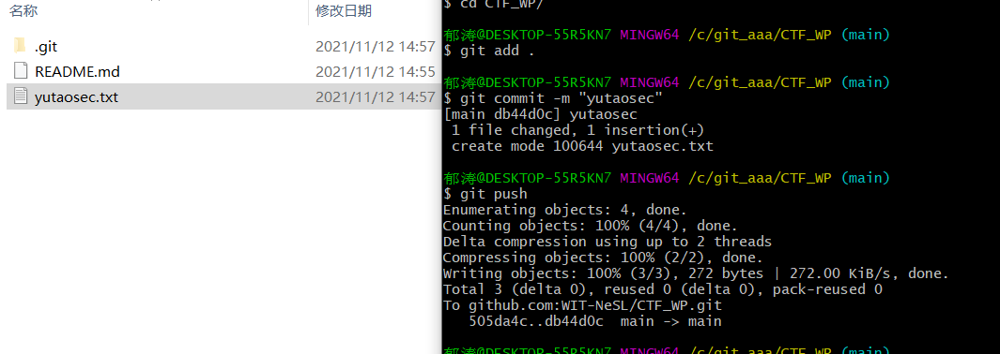

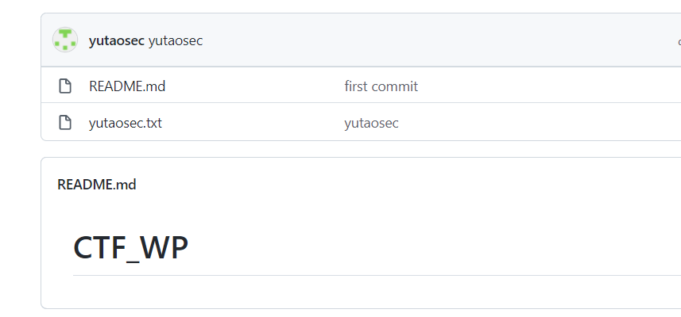

但是Ghostasky这个账户的本地仓库仍然是只有readme这个文件，我们就需要先pull下来：

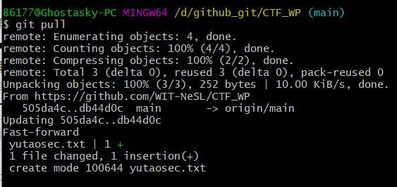

要确定pull下来了。

可以看到之前的任何改动都已经在Ghostasky用户的本地了，下面这个用户做一些更改和提交：创建Ghostasky.txt写入一些内容。

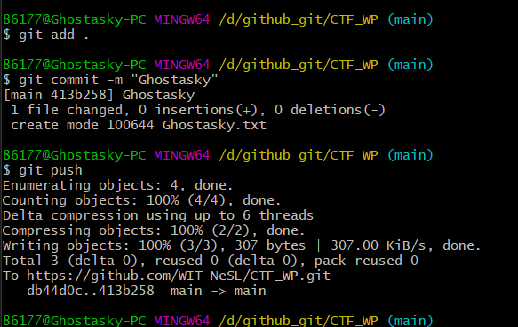

然后再看远程仓库：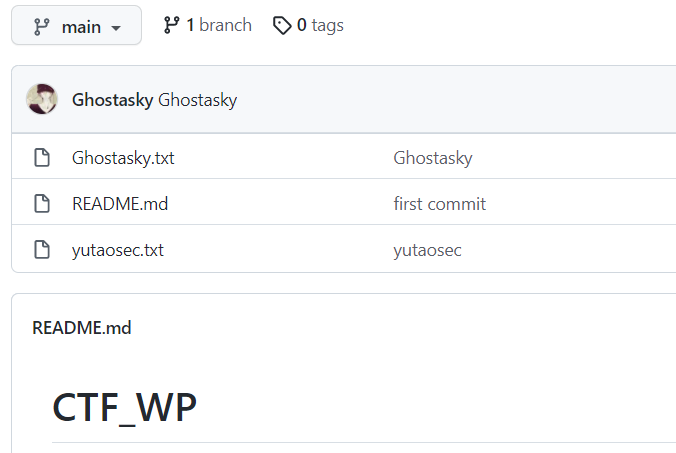

成功提交！

所以，最最重要的就是每次做更改的时候先pull再做更改。

下面是有冲突的时候（包括先更改再pull的冲突

## 有冲突时

一般不会遇到，只有在合并的时候才会遇到，我们这里只使用main分支，不太可能存在冲突的情况，如果有，那就是你没有先pull。

下面演示一下：

首先是yutaosec的账户上传了yutaosec.txt的文件：

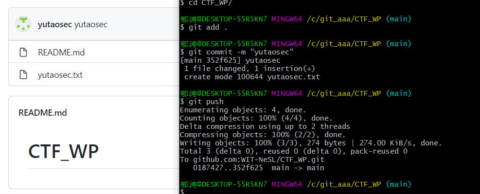

然后Ghostasky用户也上传了一个文件：

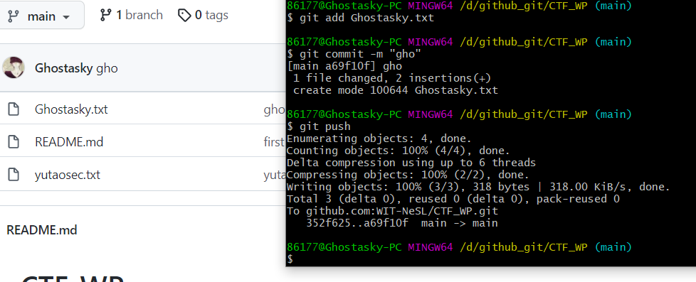

这个时候，yutaosec的本地仓库是和远程仓库不一样的，他如果没有pull而直接修改提交的话：

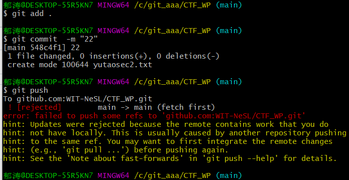

那么就要pull在提交：

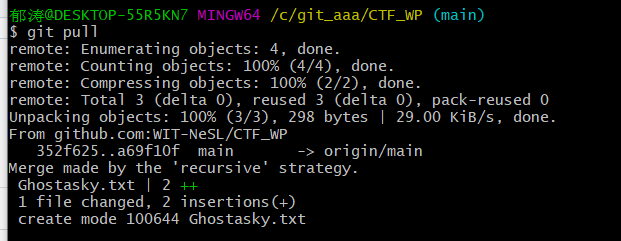

还有一种可能，是对于单个文件的修改，导致可能会有一些冲突：

这里我们使用readme来演示：

ghostasky写了一些内容

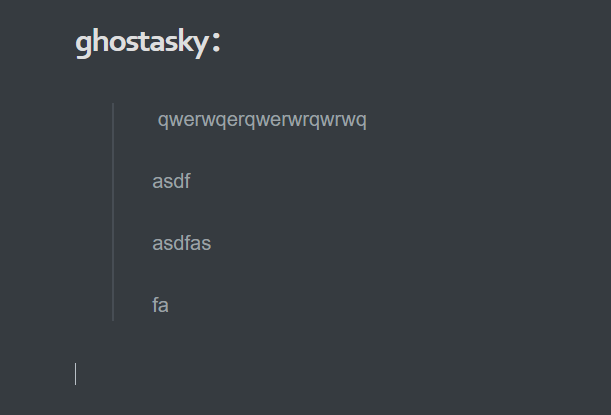

然后提交，这时yutaosec的账户没有pull，直接对他本地仓库的readme文件进行操作然后提交：

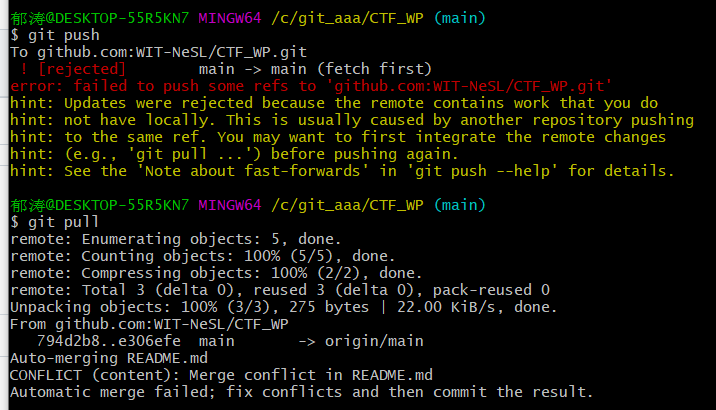

还是需要你先pull，然后观察本地的文件：

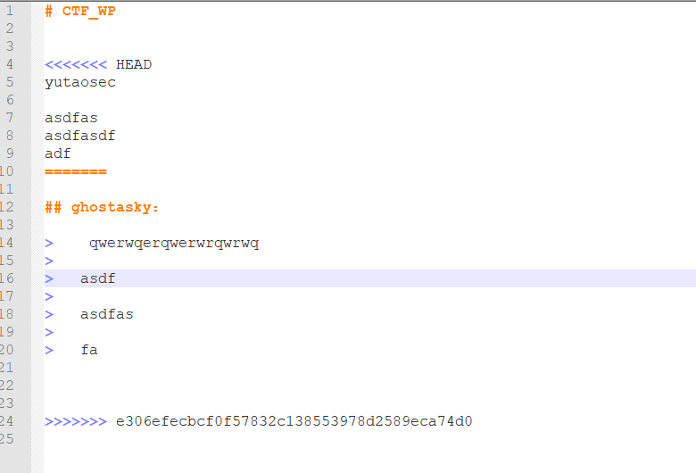

这时就需要你手动做一些修改来处理冲突，然后push

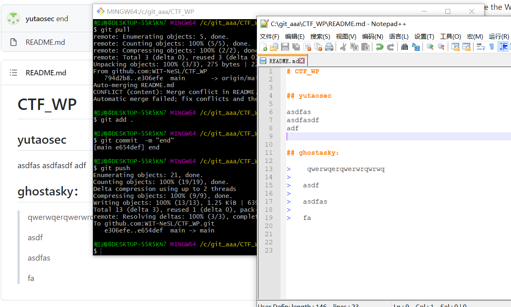

完成。