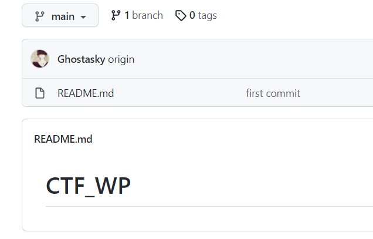

关于github多人协作：

前面的步骤只要执行一次就行，后面的部分才是需要每次提交的时候做的。

# 这里写原理

这里会写很多东西。。先空出来.

.

.

.

# 这里写步骤

## 简单无冲突时

这里我拿我的两个账号举例，一个在物理机一个在虚拟机，模拟两个人操作一个仓库。

首先要把人加进来，这个是由我来做：

最原始的仓库什么都没有：

这里我们为了方便，一律使用main这个分支。

下面是yutaosec的账户：

首先要把该仓库clone到本地：

假设yutaosec做了一些操作，比如创建了yutaosec.txt并写了一些东西。

这时yutaosec用户和远程的仓库都有了改改动：

但是Ghostasky这个账户的本地仓库仍然是只有readme这个文件，我们就需要先pull下来：

要确定pull下来了。

可以看到之前的任何改动都已经在Ghostasky用户的本地了，下面这个用户做一些更改和提交：创建Ghostasky.txt写入一些内容。

然后再看远程仓库：

成功提交！

所以，最最重要的就是每次做更改的时候先pull再做更改。

下面是有冲突的时候（包括先更改再pull的冲突

## 有冲突时

晚上写...