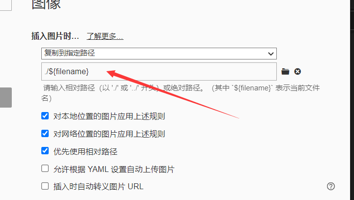

# 文件命名及内容编写

每个仓库中下面有**README.md**及相应**题解文件**

-   题解文件：

    其中题解命名规则：
    	0x01-0x20.md
    	0x21-0x40.md
    	.....
    	即每个文件中只写32道题，一级标题为:

    `0x01.题目名字aaa`，（使用十六进制）

-   README.md文件

    -   文件名记得大写
    -   一级标题为0x01-0x20等，即wp文件名，无二级标题
    -   内容为表格，共三列，第一列为题号，十六进制表示，第二列为题目名字，第三列为题目所考知识点，简要概括即可。

-   图片如何保存？

    -   这里使用Typora举例：

        

    ​    即图片保存的目录应与该题解文件名相同

    ​	至于图片名，推荐使用QQ截图后直接粘贴，这样得到的图片名不会重复；禁止使用`1.jpg,2.jpg`类似的命名方式

# 关于协作

推荐观看

https://github.com/WIT-NeSL/HowToUseGit

后完成相应试验后再开始写题解。

# 其他

每个人可以写不同的方向，每个题只写一遍，如对某些题有更好的解法(非预期题解等)或者想在之前作者的题解上修改，则可以直接在原有基础上修改；若是有它解，可以建立二级标题，注明解法二等

未防止提交的题目重复，推荐每次写题前在README文件中 `Ctrl+F` 先搜索下，避免重复。

​    

